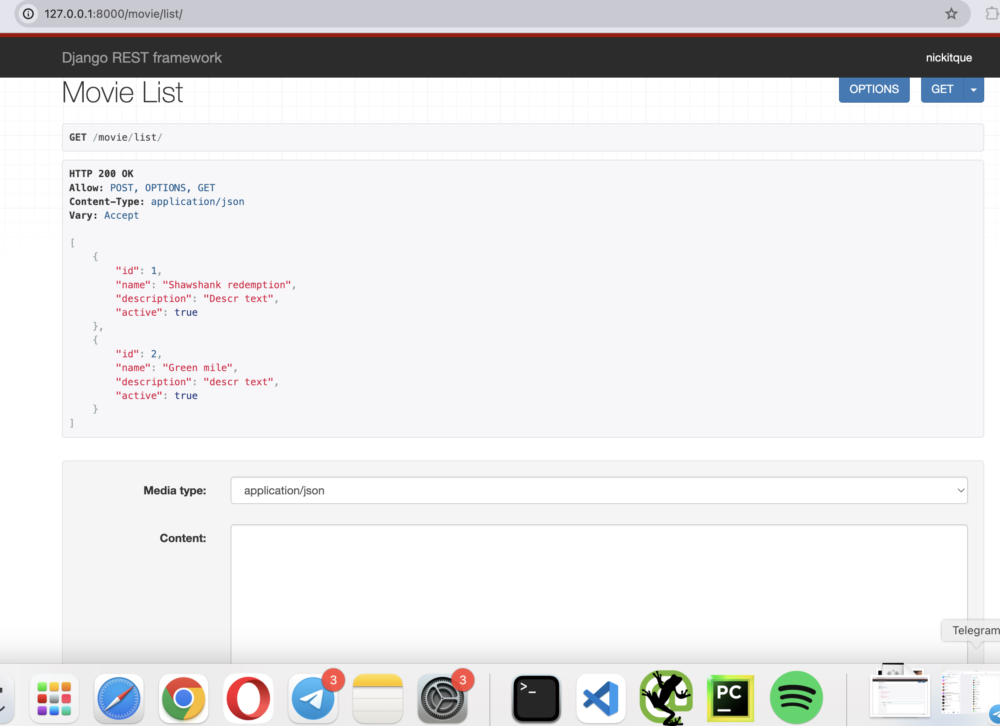

# About the Project
This is my API clone of the IMDB to show the knowledge and understanding of API and Django Rest Framework.
Django Rest Framework allows us to create browsable API with friendly HTML output. 
It has a lot of space for manual and Automated API testing.

# Knowledge that I got from this project:
<h3>1. REST API creation with Python:</h3>
<ol>
   <li>Serializers</li> 
    <li>Function-Based Views</li> 
    <li>Class-Based Views</li> 
    <li>Viewsets and Routers</li> 
    <li>Permissions</li> 
    <li>Authentications</li> 
    <li>Throttling</li> 
    <li>Django Filter Backend</li> 
    <li>Pagination</li> 
</ol>
<h3>2. Automated API Testing</h3>

<h2>Installation & Running the project</h2>
<ol>
<li>Copy the project to your local computer</li>
<li>Create VirtualEnvironment and install packages from "requirements.txt"</li>
<li>Start the local server by running command "python3 manage.py runserver"</li>
</ol>

<strong>1. Admin Access</strong>

<ul dir="auto">
<li>Admin Section:&nbsp;<a href="http://127.0.0.1:8000/dashboard/" rel="nofollow">http://127.0.0.1:8000/dashboard/</a></li>
</ul>

<strong>2. Accounts</strong>

<ul dir="auto">
<li>Registration:&nbsp;<a href="http://127.0.0.1:8000/api/account/register/" rel="nofollow">http://127.0.0.1:8000/api/account/register/</a></li>
<li>Login:&nbsp;<a href="http://127.0.0.1:8000/api/account/login/" rel="nofollow">http://127.0.0.1:8000/api/account/login/</a></li>
<li>Logout:&nbsp;<a href="http://127.0.0.1:8000/api/account/logout/" rel="nofollow">http://127.0.0.1:8000/api/account/logout/</a></li>
</ul>

<strong>3. Stream Platforms</strong>

<ul dir="auto">
<li>Create Element &amp; Access List:&nbsp;<a href="http://127.0.0.1:8000/api/watch/stream/" rel="nofollow">http://127.0.0.1:8000/api/watch/stream/</a></li>
<li>Access, Update &amp; Destroy Individual Element:&nbsp;<a href="http://127.0.0.1:8000/api/watch/stream/%3Cint:streamplatform_id%3E/" rel="nofollow">http://127.0.0.1:8000/api/watch/stream/&lt;int:streamplatform_id&gt;/</a></li>
</ul>

<strong>4. Watch List</strong>

<ul dir="auto">
<li>Create &amp; Access List:&nbsp;<a href="http://127.0.0.1:8000/api/watch/" rel="nofollow">http://127.0.0.1:8000/api/watch/</a></li>
<li>Access, Update &amp; Destroy Individual Element:&nbsp;<a href="http://127.0.0.1:8000/api/watch/%3Cint:movie_id%3E/" rel="nofollow">http://127.0.0.1:8000/api/watch/&lt;int:movie_id&gt;/</a></li>
</ul>

<strong>5. Reviews</strong>

<ul dir="auto">
<li>Create Review For Specific Movie:&nbsp;<a href="http://127.0.0.1:8000/api/watch/%3Cint:movie_id%3E/reviews/create/" rel="nofollow">http://127.0.0.1:8000/api/watch/&lt;int:movie_id&gt;/reviews/create/</a></li>
<li>List Of All Reviews For Specific Movie:&nbsp;<a href="http://127.0.0.1:8000/api/watch/%3Cint:movie_id%3E/reviews/" rel="nofollow">http://127.0.0.1:8000/api/watch/&lt;int:movie_id&gt;/reviews/</a></li>
<li>Access, Update &amp; Destroy Individual Review:&nbsp;<a href="http://127.0.0.1:8000/api/watch/reviews/%3Cint:review_id%3E/" rel="nofollow">http://127.0.0.1:8000/api/watch/reviews/&lt;int:review_id&gt;</a></li>
</ul>